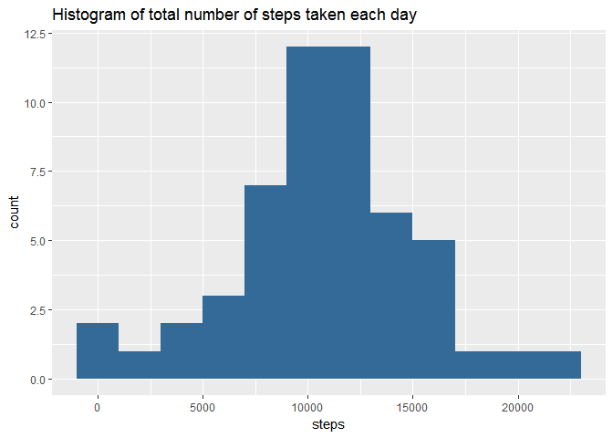
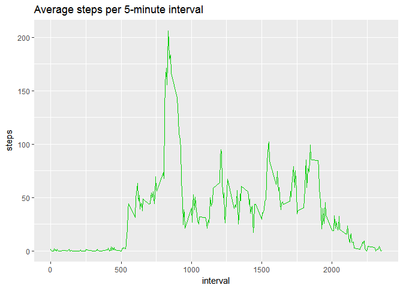
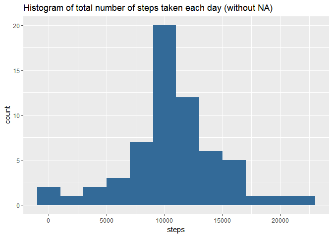
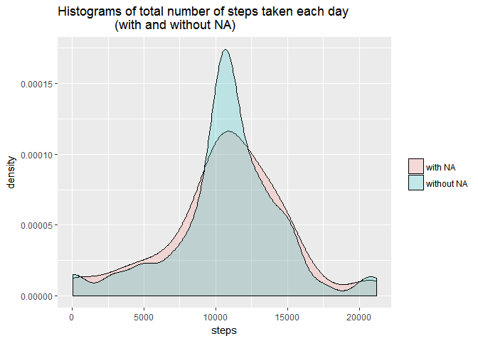

#Reproducible Research - Project Assignment 1
PF, January 15, 2017

This project assignment is all about writing a report that 

1. Answers a couple of questions on a activity data set
2. Shows the codes used to answer those questions
3. Can be processed by knitr and transformed into an HTML file

###Data

The data for this assignment can be downloaded from the course web site:

- Dataset: [Activity monitoring data [52K]](https://d396qusza40orc.cloudfront.net/repdata%2Fdata%2Factivity.zip)

The variables included in this dataset are:

- steps: Number of steps taking in a 5-minute interval (missing values are coded as NA)
- date: The date on which the measurement was taken in YYYY-MM-DD format
- interval: Identifier for the 5-minute interval in which measurement was taken

The dataset is stored in a comma-separated-value (CSV) file and there are a total of 17,568 observations in this dataset.

###Questions

####Loading and preprocessing the data

1. Load the data (i.e.  read.csv() )
2. Process/transform the data (if necessary) into a format suitable for your analysis

Here is the code to download the data, unzip the file, load the data "activity.csv", check the class of each variable and transform the variable "date" into a date variable.

```r
fileURL <- "https://d396qusza40orc.cloudfront.net/repdata%2Fdata%2Factivity.zip"
download.file(fileURL, destfile = "activity.zip")
unzip("activity.zip")

data <- read.csv("activity.csv", stringsAsFactors = FALSE, sep = ",")

dim(data)
```

```
## [1] 17568     3
```

```r
names(data)
```

```
## [1] "steps"    "date"     "interval"
```

```r
str(data)
```

```
## 'data.frame':	17568 obs. of  3 variables:
##  $ steps   : int  NA NA NA NA NA NA NA NA NA NA ...
##  $ date    : chr  "2012-10-01" "2012-10-01" "2012-10-01" "2012-10-01" ...
##  $ interval: int  0 5 10 15 20 25 30 35 40 45 ...
```

```r
data$date <- as.Date(data$date)
```

####What is mean total number of steps taken per day?
For this part of the assignment, you can ignore the missing values in the dataset.

1. Make a histogram of the total number of steps taken each day
2. Calculate and report the mean and median total number of steps taken per day

Here is the code to calculate the total number of steps taken each day, to draw a histogram, and to calculate the mean and median of the total number of steps taken per day.


```r
library(ggplot2)
data1 <- aggregate(steps ~ date, data = data, sum)
ggplot(data1, aes(steps)) + geom_histogram(aes(fill = 2), binwidth = 2000) + 
        ggtitle("Histogram of total number of steps taken each day") + theme(legend.position = "none")
```

<!-- -->

```r
mean(data1$steps)
```

```
## [1] 10766.19
```

```r
median(data1$steps)
```

```
## [1] 10765
```

####What is the average daily activity pattern?

1. Make a time series plot (i.e.  type = "l" ) of the 5-minute interval (x-axis) and the average number of steps taken, averaged across all days (y-axis)

Here is the code to calculate the average number of steps taken per interval, averaged over all days and then to draw a plot.


```r
data2 <- aggregate(steps ~ interval, data = data, FUN = mean)
ggplot(data2, aes(interval, steps)) + geom_line(col = 3) + 
        ggtitle("Average steps per 5-minute interval")
```

<!-- -->


2. Which 5-minute interval, on average across all the days in the dataset, contains the maximum number of steps?

Here is the code to find to interval with the maximum average number of steps. 

```r
maxsteps <- max(data2$steps)
data2[data2$steps == maxsteps,]
```

```
##     interval    steps
## 104      835 206.1698
```


####Imputing missing values
Note that there are a number of days/intervals where there are missing values (coded as NA ). The presence of missing days may introduce bias into some calculations or summaries of the data.

1.Calculate and report the total number of missing values in the dataset (i.e. the total number of rows with NAs).

Here is the code to calculate the total number of rows with missing values. I double checked the number with a different code. 


```r
summary(data$steps)
```

```
##    Min. 1st Qu.  Median    Mean 3rd Qu.    Max.    NA's 
##    0.00    0.00    0.00   37.38   12.00  806.00    2304
```

```r
sum(!complete.cases(data))
```

```
## [1] 2304
```

2. Devise a strategy for filling in all of the missing values in the dataset. The strategy does not need to be sophisticated. For example, you could use the mean/median for that day, or the mean for that 5-minute interval, etc.

My strategy: **I replace the missing values with the mean of the steps of the corresponding 5-minute-interval**

3. Create a new dataset that is equal to the original dataset but with the missing data filled in.

Here is the code to replace the missing values in the data set with the mean of the corresponding
mean of steps of the corresponding 5-minute-interval.


```r
data3 <- aggregate(steps ~ interval, data = data, FUN = mean, na.rm = T)
data4 <- data[,]
data4 <- transform(data4, steps = ifelse(is.na(data4$steps), data3$steps[match(data4$interval, data3$interval)], data4$steps))
```

4 Make a histogram of the total number of steps taken each day and Calculate and report the mean and median total number of steps taken per day. Do these values differ from the estimates from the first part of the assignment? What is the impact of imputing missing data on the estimates of the total daily number of steps?

Here is the code to first draw a histogram of the data set without any NAs, the mean and median of total number of steps taken per day and the corresponding differences to the mean and median of the data set with NAs.


```r
data5 <- aggregate(steps ~ date, data = data4, sum)
ggplot(data5, aes(steps)) + geom_histogram(aes(fill = 3), binwidth = 2000) + 
        ggtitle("Histogram of total number of steps taken each day (without NA)") + 
        theme(legend.position = "none")
```

<!-- -->

```r
mean(data5$steps)
```

```
## [1] 10766.19
```

```r
median(data5$steps)
```

```
## [1] 10766.19
```

```r
mean(data1$steps) - mean(data5$steps)
```

```
## [1] 0
```

```r
median(data1$steps) - median(data5$steps)
```

```
## [1] -1.188679
```

The mean remains the same. However, the median is slightly higher than the one of the data set with NAs. 

Here is the code to draw the density of both data sets to see the difference in the distribution
of total number of steps taken each day. 


```r
data1$new <- "data1"
data5$new <- "data5"
newdata <- rbind(data1,data5)

ggplot(newdata, aes(steps, fill = factor(new, labels = c("with NA", "without NA")))) + 
        geom_density(alpha = 0.2) +
        ggtitle("Histograms of total number of steps taken each day 
                (with and without NA)") + guides(fill=guide_legend(title=NULL))
```

<!-- -->

####Are there differences in activity patterns between weekdays and weekends?

For this part the  weekdays()  function may be of some help here. Use the dataset with the filled-in missing values for this part.

1. Create a new factor variable in the dataset with two levels -- "weekday" and "weekend" indicating whether a given date is a weekday or weekend day.

This is the code to add either "weekday" or "weekend" to each day in the data set without NAs. The first part of the code is to change the system language to english. 

```r
Sys.setenv("LANGUAGE"="En")
Sys.setlocale("LC_ALL", "English")
```

```
## [1] "LC_COLLATE=English_United States.1252;LC_CTYPE=English_United States.1252;LC_MONETARY=English_United States.1252;LC_NUMERIC=C;LC_TIME=English_United States.1252"
```

```r
weekdays1 <- c("Monday", "Tuesday", "Wednesday", "Thursday", "Friday") 
data4$wDay <- factor((weekdays(data4$date) %in% weekdays1), levels=c(FALSE, TRUE), 
                     labels=c("weekend", "weekday"))
```

2. Make a panel plot containing a time series plot (i.e.  type = "l" ) of the 5-minute interval (x-axis) and the average number of steps taken, averaged across all weekday days or weekend days (y-axis).

This is the code to draw two plots, one showing the average number of steps taken per 5-minute interval at weekdays, one showing the average number of steps taken per 5-minute interval at weekends. 


```r
data6 <- aggregate(steps ~ interval + wDay, data = data4, FUN = mean)
ggplot(data6, aes(interval, steps)) + geom_line(col = 3) + facet_grid(wDay ~ . )+
        ggtitle("Average steps per 5-minute interval")
```

<!-- -->


